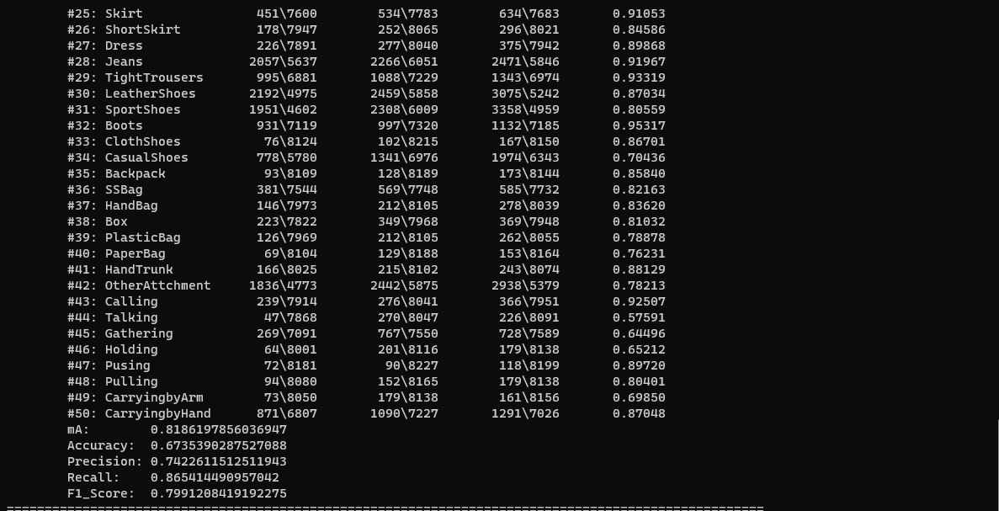

# Introduction
This repository corresponds to the paper #6 [Improving Pedestrian Attribute Recognition With Weakly-Supervised Multi-Scale Attribute-Specific Localization](https://arxiv.org/abs/1910.04562)
# Environment and Dependencies
1. Python version = 3.6+
2. Pytorch version = 0.4+

# Creating Datasets
1. Download the data from the following links : [PETA](https://www.dropbox.com/s/52ylx522hwbdxz6/PETA.zip?dl=0), [RAP(v1)](http://www.rapdataset.com/), [PA100K](https://drive.google.com/drive/folders/0B5_Ra3JsEOyOUlhKM0VPZ1ZWR2M?resourcekey=0-CdctEkdX1j2GSMSWWfrPSQ)
2. Arrange the data directory in the following tree structure : 
```
data
|--peta
|   |--PETA_dataset
    |   |--3DPeS
        |--CAVIAR4REID
        |--CUHK
        |--GRID
        |--i-LID
        |--MIT
        |--PRID
        |--SARC3D
        |--TownCentre
        |--VIPeR
|--rap
|   |--RAP_dataset
    |--RAP_annotation
    |   |--RAP_annotation.mat
        |--rap_evaluation.m
        |--ReadMe.txt
|--pa100k

```
4. Change the `data-path` in the `utils/datasets.py` file in line 183-197

# Pretrained Models
The models are provided to run the test script.
| Dataset | mA    | Link                                                         |
| ------- | ----- | ------------------------------------------------------------ |
| PETA    | 86.34 | [Model](https://drive.google.com/file/d/14A94X4jE92lyWAZcQhf4kzL41g37-WGD/view?usp=share_link) |
| RAP     | 81.86 | [Model](https://drive.google.com/file/d/1NAw4FeviwRcTYDCle-UvVHUbWbeGYFVZ/view?usp=share_link) |
| PA-100K | 80.45 | [Model](https://drive.google.com/file/d/1OILuMucSs7x7U7Nab-bYl-D_6OWHkjN0/view?usp=sharing) |

# Experiment
Change the `experiment` argument to peta, rap and pa100k accordingly. Then run the following script : <br><br>
`python main.py --approach=inception_iccv --experiment=rap -e --resume='model_path'`

# Example
1. Modify the arguments for RAP dataset : <br> 
`python main.py --approach=inception_iccv --experiment=rap -e --resume='./rap.pth.tar'` <br><br>
2. Test Result : 

