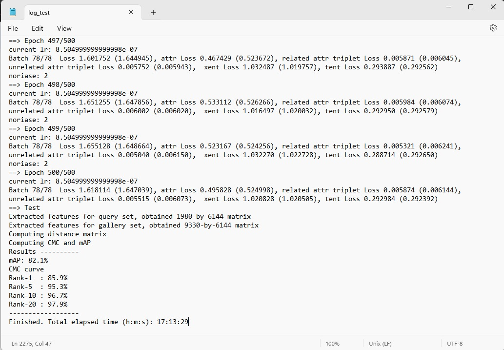

# Introduction
This repository corresponds to the paper #8
[Attribute-aware Identity-hard Triplet Loss for Video-based Person Re-identification](https://arxiv.org/abs/2006.07597)

# Dependencies
Following dependencies are to be installed : <br>
1. pytorch >= 0.4.1 
2. torchvision >= 0.2.1
3. tqdm 

# Creating Datasets
1. Download [MARS](http://zheng-lab.cecs.anu.edu.au/Project/project_mars.html) dataset.
2. Download the split information : https://github.com/liangzheng06/MARS-evaluation/tree/master/info and put the files from here to the `info/` directory.
3. Download the `mars_attributes.csv` file from : https://irip.buaa.edu.cn/mars_duke_attributes/index.html

4. Arrange the data directory in the following tree structure : 

```
mars
|   |--bbox_test/
    |--bbox_train/
    |--info/
    |--mars_attributes.csv

```
5. Change the global variable `_C.DATASETS.ROOT_DIR` to `/path2mars/mars` and `_C.DATASETS.NAME` to `mars` in config or configs.

# Pretrained Model
The model is provided to run the test script.
| Dataset |  Rank-1  |  Rank-5  |  mAP    | Link                                                         |
| ------- | -------- | -------- | ------- | ------------------------------------------------------------ |
| MARS    |  85.9%   |  95.3%   |  82.1%  | [Model](https://drive.google.com/file/d/1vnlreZkFUd1Z3kmww46INOChExIh53VK/view?usp=sharing)  |


# Experiment
Training the model : <br>
`python main_baseline.py`

# Example
The test result for MARS dataset is obtained : <br>

