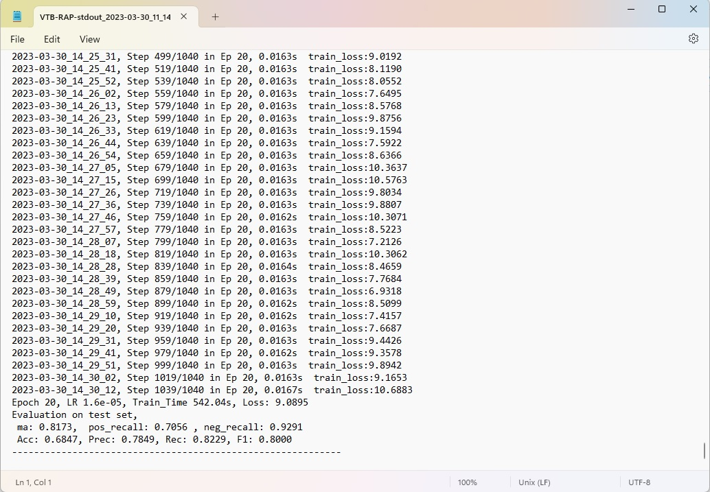

# Introduction
This repository corresponds to the paper #5 
[A Simple Visual-Textual Baseline for Pedestrian Attribute Recognition](https://ieeexplore.ieee.org/stamp/stamp.jsp?tp=&arnumber=9782406&tag=1)

# Environment and Dependencies
Install the dependencies : <br>
`pip install -r requirements.txt`

# Creating Datasets
1. Download the data from the following links : [RAP(v1)](), [PA100K]()
2. The Image-Net pretrained model [ViT-Base](https://github.com/rwightman/pytorch-image-models/releases/download/v0.1-vitjx/jx_vit_base_p16_224-80ecf9dd.pth) 
needs to be downloaded for pretraining.
3. Put the pretrained model in a diretory `./checkpoints/jx_vit_base_p16_224-80ecf9dd.pth`
4. Arrange the data directory in the following tree structure : 
```
dataset
|--rap
|   |--RAP_dataset
    |--RAP_annotation
    |   |--RAP_annotation.mat
    |--rap_evaluation.m
    |--ReadMe.txt
    |--dataset.pkl
|--PA100k
|   |--data
    |--annotation.mat
    |--dataset.pkl
    |--README.txt

```
5. Change the `data-path` in the `dataset/preprocess/pa100k.py` and `dataset/preprocess/rap.py` files in line 72 and 81 respectively.

# Pretrained Models
The models are provided to run the test script.
| Dataset | mA    | Link                                                         |
| ------- | ----- | ------------------------------------------------------------ |
| RAP     | 81.73 | [Model]()                                                    |
| PA-100K | 82.54 | [Model]()                                                    |

# Experiment
Training the model : <br>
`python train.py *dataset-name*`

# Example
1. Train the model using RAP dataset : <br>
`python train.py RAP`

2. The test result for RAP dataset is obtained in a `.txt` log file.

