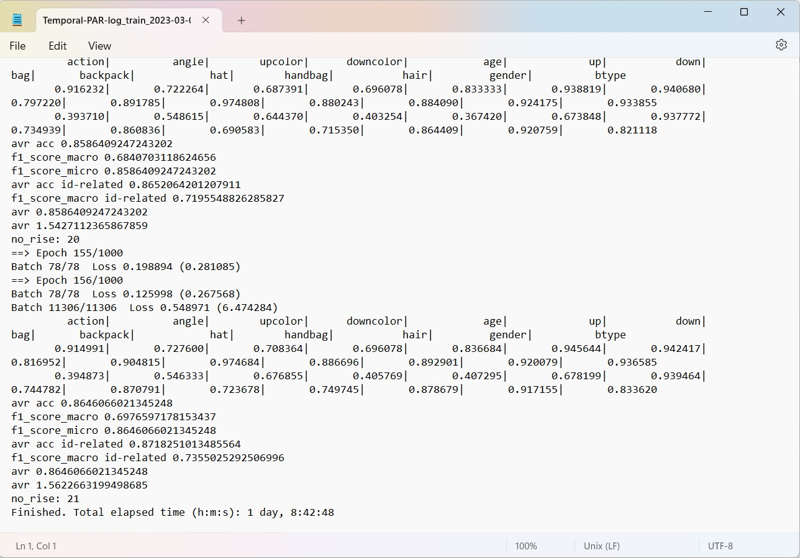

# Introduction
This repository corresponds to the paper #7
[A Temporal Attentive Approach for Video-Based Pedestrian Attribute Recognition](https://arxiv.org/abs/1901.05742)

# Dependencies
Following dependencies are to be installed : <br>
1. Python 3.7
2. PyTorch 0.4.1
3. Torchvision 0.2.1 

# Creating Datasets
1. Download [MARS](http://zheng-lab.cecs.anu.edu.au/Project/project_mars.html) dataset.
2. Download the split information : https://github.com/liangzheng06/MARS-evaluation/tree/master/info and put the files from here to the `info/` directory.
3. Download the `mars_attributes.csv` file from : https://irip.buaa.edu.cn/mars_duke_attributes/index.html

4. Arrange the data directory in the following tree structure : 
```
data
|--mars
|   |--bbox_test/
    |--bbox_train/
    |--info/
    |--mars_attributes.csv


```

# Pretrained Models
The models are provided to run the test script.
| Dataset | mA    | Link                                                         |
| ------- | ----- | ------------------------------------------------------------ |
| MARS    | 86.46 | [Model]()                                                    |


# Experiment
Training the model : <br>
`python -u main_video_attr_recog.py --arch=attr_resnet50tp --model_type="ta" -d mars`

# Example
The test result for MARS dataset is obtained : <br>

