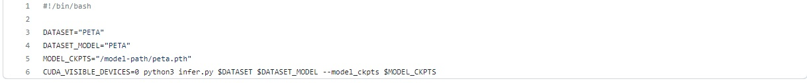
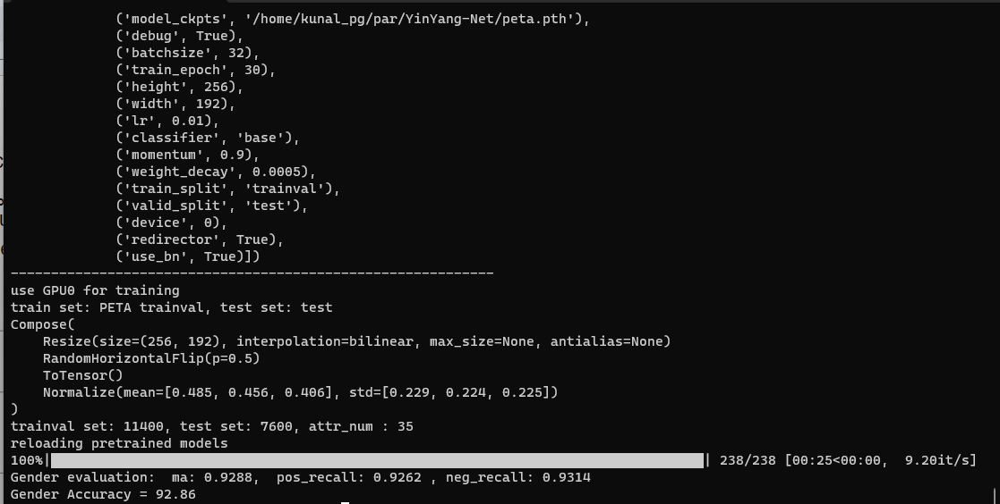

# Environment and Dependencies
1. Create conda environment with python version : **3.7.6**<br>
`conda create -n env_name python=3.7.6`
2. Install all the required packages <br>
`pip install -r requirements.txt`

# Creating Datasets
There are 6 datasets used in the experiments. Three parent datasets : PETA, RAP, PA100k and three derived datasets : peta_frontal, rap_frontal, pa100k_frontal. <br>
The direct download-able links are provided. Arrange the data by following the given tree directory : 
```
data
|--PETA
|   |--images
|   |--dataset.pkl
|--RAP
|   |--RAP_dataset
|   |--dataset.pkl
|--PA100k
|   |--data
|   |--dataset.pkl
|--peta_frontal
|   |--dataset.pkl
|--rap_frontal
|   |--dataset.pkl
|--pa100k_frontal
    |--dataset.pkl
```
The frontal version of each dataset contain the *.pkl* of the respective folder. The facial region images can be downloaded from [here](https://drive.google.com/drive/folders/1t9xvksiqQnwS2pWyGB-0oLWJbrBvesYT?usp=sharing). Each dataset zip has the folder `face_images`, which should be added to PETA, RAP and PA100k, in `data`.
# Testing the models
The checkpoint file against each training is provided along with the results. <br>
There are two variables in the *infer script* named `DATASET` and `DATASET_MODEL`. You need to change both to one of the **six possible names**: PETA, RAP, PA100k, peta_frontal, rap_frontal, or pa100k_frontal. <br> <br>
For testing, use the model for each dataset and change the path in `MODEL_CKPTS` in the *infer script*. Then run the following command : <br>
`bash infer.sh` <br> <br>
The checkpoints for each dataset is provided in the following table : 
| Dataset        | mA    | model       |
|----------------|-------|-------------|
| PETA           | 93.39 | [checkpoints]() |
| PETA<sub>Frontal</sub>     | 93.45 | [checkpoints]() |
| PA-100K        | 91.20 | [checkpoints]() |
| PA-100K<sub>Frontal</sub> | 92.79 | [checkpoints]() |
| RAP            | 96.86 | [checkpoints]() |
| RAP<sub>Frontal</sub>    | 97.07 | [checkpoints]() |
---

# Example
1. Infer script for PETA dataset

2. Result for PETA dataset


